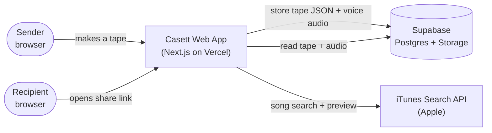
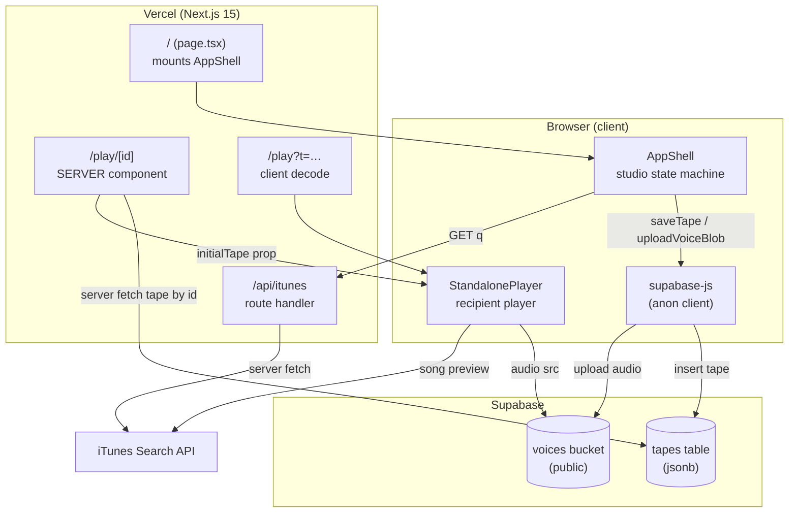
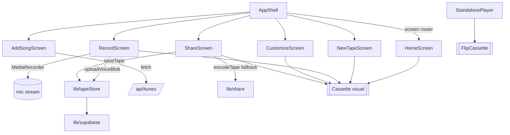
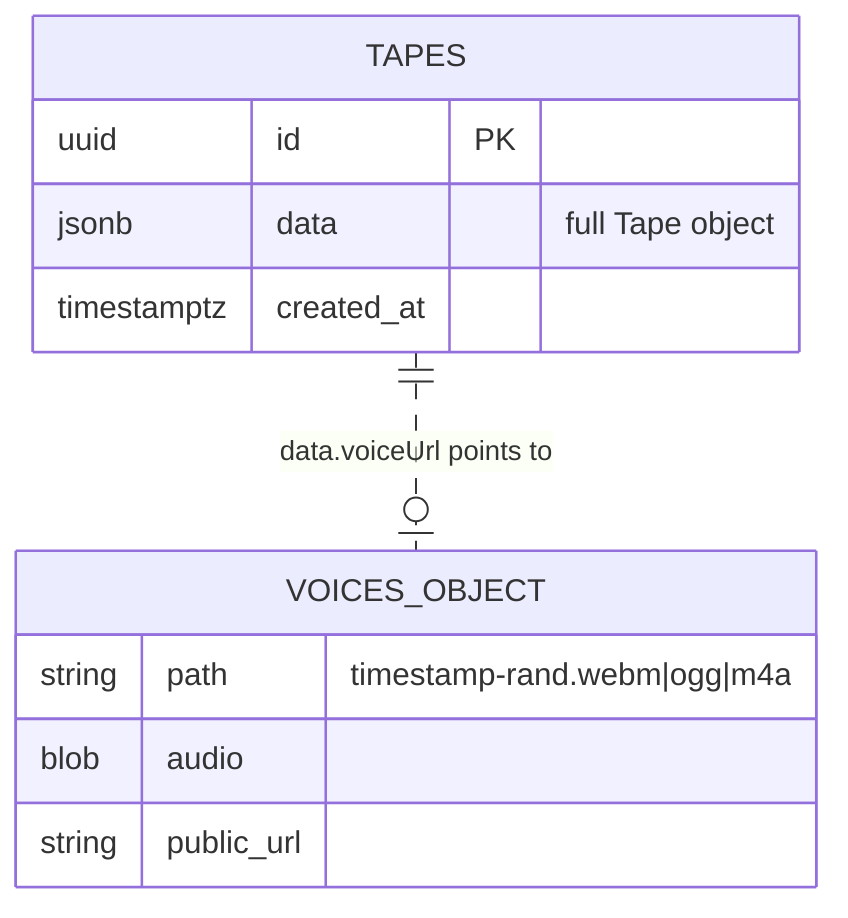
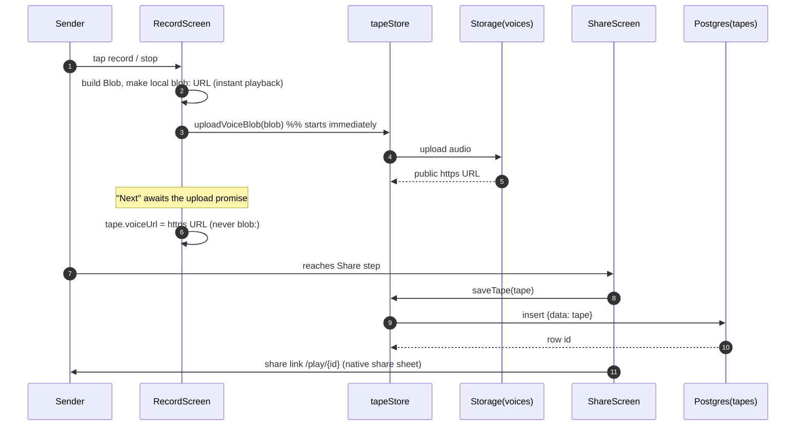
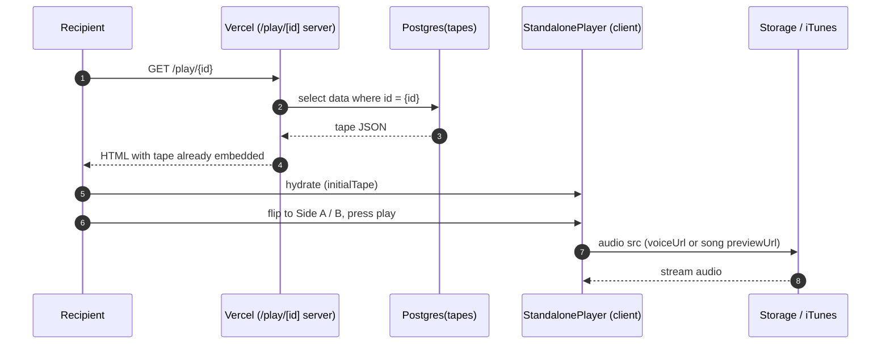
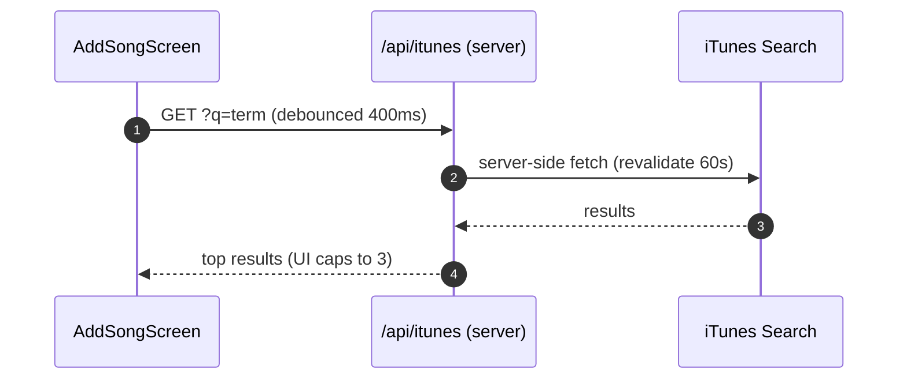
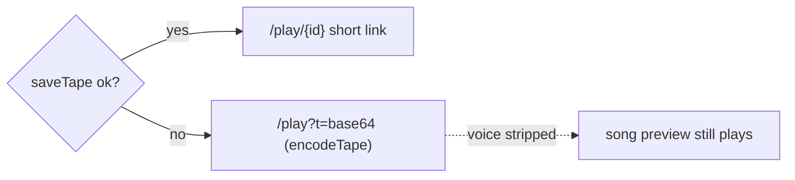
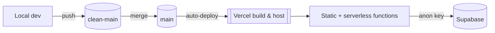

# Casett — System Design

> Companion to `SPEC.md`. This document focuses on **how the system is put
> together and how data moves through it** — components, boundaries, runtime
> paths, storage, and failure handling.

- **Last updated:** 2026-06-19
- **Scope:** the deployed system (Next.js on Vercel + Supabase).

---

## 1. System context (C4 — Level 1)



**Actors**
- **Sender** — records voice, picks a song, customizes, gets a link.
- **Recipient** — opens the link, plays the flippable cassette. No account.

**External systems**
- **Supabase** — durable storage for tape metadata (Postgres) and voice audio
  (Storage). Accessed from the browser with the **anon** key, gated by RLS.
- **iTunes Search API** — song search results + 30s preview URLs. Never called
  from the browser directly (see §6).

---

## 2. Container view (C4 — Level 2)



### Key boundary decisions
- **Studio is client-side.** The whole 5-step flow runs in one mounted
  `AppShell`; no server round-trips between steps. State lives in React + a
  `localStorage` draft mirror.
- **The player's primary route is a server component.** `/play/[id]` fetches
  the tape on the server *before* sending HTML — fast first paint, shareable,
  crawlable, and the anon key fetch happens server-side.
- **iTunes is only reachable via the server route handler** `/api/itunes`.

---

## 3. Component view (inside the browser)



| Module | Responsibility |
|---|---|
| `AppShell` | Owns `screen` + working `tape`; routes screens; persists draft. |
| `screens/*` | One concern each (title, record, song, customize, share, home). |
| `cassette/*` | Pure visual: shell, reels, label, stickers; `FlipCassette` for A/B. |
| `lib/tapeStore` | All Supabase writes/reads (upload audio, insert/read tape). |
| `lib/supabase` | Single anon browser client (null-safe if env missing). |
| `lib/share` | URL-safe base64 encode/decode of a tape (fallback transport). |
| `lib/data` | Static design data: shells, fonts, stickers, `FRESH_TAPE()`. |
| `app/api/itunes` | Server proxy to iTunes Search (iOS-safe). |

---

## 4. Data architecture

### 4.1 Stored shapes


- The **entire `Tape`** (title, from, shell, font, stickers, song, voiceLen,
  `voiceUrl`) is denormalized into one `jsonb` column. No joins, no schema
  migrations when the tape shape evolves.
- **Voice audio is not in Postgres** — only the public Storage URL is, inside
  `data.voiceUrl`. The song's audio is an external iTunes preview URL.
- The row `id` (uuid) **is** the share-link key.

### 4.2 Access control
- One anon API key, used from both browser and server component.
- **RLS** on `tapes`: anon `insert (check true)` + anon `select (using true)`.
- **`voices`** is a **public** bucket with anon upload + public read.
- Trade-off: anyone with a tape `id` can read it (unguessable uuid acts as a
  bearer token). Acceptable — tapes are meant to be shared, not secret.

---

## 5. Runtime flows

### 5.1 Create & send (happy path)



**Why upload-on-stop + await:** removes any later `fetch(blob:)` (iOS-hostile)
and guarantees the saved tape carries a real `https://` voice URL, never a
device-local `blob:` one.

### 5.2 Receive & play



### 5.3 Song search



---

## 6. Cross-cutting concerns

### 6.1 iOS / Safari hardening (drove three design choices)
| Problem | Root cause | System response |
|---|---|---|
| No song results on iPhone | iOS blocks browser `fetch()` to `itunes.apple.com` | All search goes through the `/api/itunes` **server proxy** |
| "Load failed" on upload | iOS restricts `fetch()` of a `blob:` URL | Upload the **`Blob` object directly**; never re-fetch a blob URL |
| Recipient hears nothing | Race: advanced before background upload finished → `blob:` saved | `proceed()` **awaits** the upload before saving the tape |

### 6.2 Resilience / fallbacks

- If the Supabase insert fails, Share falls back to an **encoded-URL link**
  (`lib/share`). The voice (a `blob:` URL) is stripped in that mode; the song
  preview, being a real iTunes URL, still works. A share is never dead.

### 6.3 State & persistence
- **Working draft:** `AppShell` mirrors `screen` + `tape` to `localStorage`
  (`cz_screen`, `cz_tape`) on every change; restored on mount behind a
  `hydrated` guard so a refresh resumes the flow.
- **Durable record:** only created at the Share step (`saveTape`).
- **No global store / no server session.** Sender and recipient share nothing
  but the link.

### 6.4 Failure modes & handling
| Failure | Effect | Handling |
|---|---|---|
| Mic permission denied | Can't record | Inline error; user may skip voice (song-only) |
| iTunes/proxy error | No results | Empty state; search is non-blocking |
| Voice upload fails | No cross-device voice | Caught; tape still saves (song-only) |
| Supabase insert fails | No short link | Encoded-URL fallback link |
| Missing/invalid `id` | — | Player shows "No tape found" + make-your-own CTA |
| Env vars missing | — | `lib/supabase` exports `null`; guarded everywhere |

---

## 7. Deployment topology



- **Production = `main`**; Vercel auto-builds on push. Working branch is
  `clean-main`. Release = commit to `clean-main` → merge to `main` → push.
- **Rendering mix:** `/` and `/play` are static/CSR; `/play/[id]`,
  `/api/itunes` are serverless (dynamic).
- **Secrets:** `NEXT_PUBLIC_SUPABASE_URL` / `_ANON_KEY` in Vercel project +
  local `.env.local` (gitignored). Env changes need a manual redeploy.

---

## 8. Scaling & evolution notes

- **Read-heavy, tiny writes.** Most traffic is recipients reading one tape.
  `/play/[id]` is a single indexed primary-key lookup; Supabase + Vercel edge
  handle this comfortably with no app-level cache.
- **Statelessness** makes horizontal scale trivial — every request is
  self-contained; no sessions to replicate.
- **Cost/abuse surface:** anon insert + public upload are open by design.
  Natural next steps if abused: rate-limiting at the edge, size/duration caps
  on uploads (already 90s), and a TTL/cleanup job for old `voices` objects.
- **Likely evolutions:** signed/short link slugs instead of raw uuids, an
  optional "claim" step for senders, and pruning the legacy unused modules
  (`api/spotify`, Library/WebPlayer screens) noted in `SPEC.md` §12.
```
